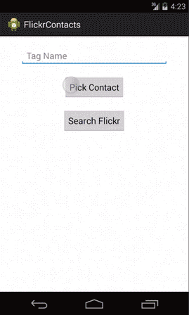

Venue Map Search App
===================

Chris D'Angelo  
cd2665@columbia.edu  
2/25/14
Cellular Networks & Mobile Computing  
Assignment 2

Demo
====

Description
==========

An application that using Flickr Search API to search a keyword.
Thumbnail images are displayed asynchronously in a ListView. Clicking
on an image will show the list in a larger view in the default Android
browser. User can use their contacts application to complete the keyword
search field.

Sources
=======

* Android Programming: Big Nerd Ranch Guide (2013) Ch. 26
* http://developer.android.com/training/basics/network-ops/connecting.html
* http://developer.android.com/training/basics/network-ops/xml.html
* http://developer.android.com/reference/org/xmlpull/v1/XmlPullParser.html
* http://www.flickr.com/services/api/flickr.photos.search.html
* Android Programming: Big Nerd Ranch Guide (2013) Ch. 10
* Android Programming: Big Nerd Ranch Guide (2013) Ch. 9
* Android Programming: Big Nerd Ranch Guide (2013) Ch. 21
* Android Programming: Big Nerd Ranch Guide (2013) Ch. 27
* http://developer.android.com/training/basics/network-ops/connecting.html
* http://www.deitel.com/articles/java_tutorials/20060106/VariableLengthArgumentLists.html
* http://stackoverflow.com/questions/19351160/implements-onscrolllistener-inside-listfragment
* http://stackoverflow.com/questions/10316743/detect-end-of-scrollview
* http://stackoverflow.com/questions/12206259/adding-footer-to-one-of-the-listfragments-listview-automatically-adds-footer-to
* http://stackoverflow.com/questions/2250770/how-to-refresh-android-listview
* http://stackoverflow.com/questions/21374432/cant-set-a-custom-listview-on-listfragment
* https://github.com/shontauro/android-pulltorefresh-and-loadmore

Note:

Enormously useful to my learning the Android platform was [Android Programming: Big Nerd Ranch Guide 2013](http://www.bignerdranch.com/book/android_the_big_nerd_ranch_guide). To understand the basics of Android programming I worked through nearly every one of the book's examples. The book's examples also provided a template for the end design of this project. I have cited the book's influence on each source code document.
